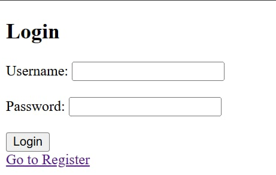
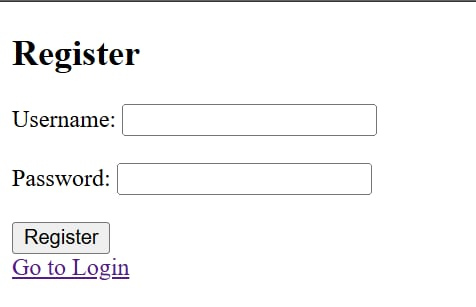
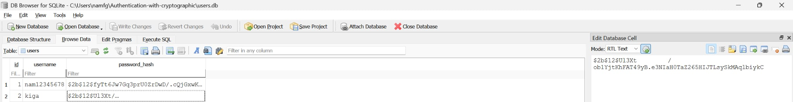

# Authentication with Cryptography

## Overview

In this demo, when users open the website, they are first redirected to the **Login page**.

If users do not have an account, they can navigate to the **Register page**.  
If they already have an account, they can log in to access the **Main page** of the system.

---

## Register Page

On the Register page, users are required to create an account with a password that satisfies the following conditions:

- Minimum length of 8 characters  
- At least 1 uppercase letter    
- At least 1 numeric digit  

If the registration is successful, the system redirects the user back to the Login page so they can log in and access the main page.

---

## Password Storage

Passwords are **not stored in plaintext**.  
Instead, they are securely hashed before being saved into the SQLite database.

Each password is stored as a cryptographic hash (e.g., bcrypt format starting with `$2b$...`).  
This ensures that even if the database is leaked, attackers cannot directly retrieve the original passwords.
